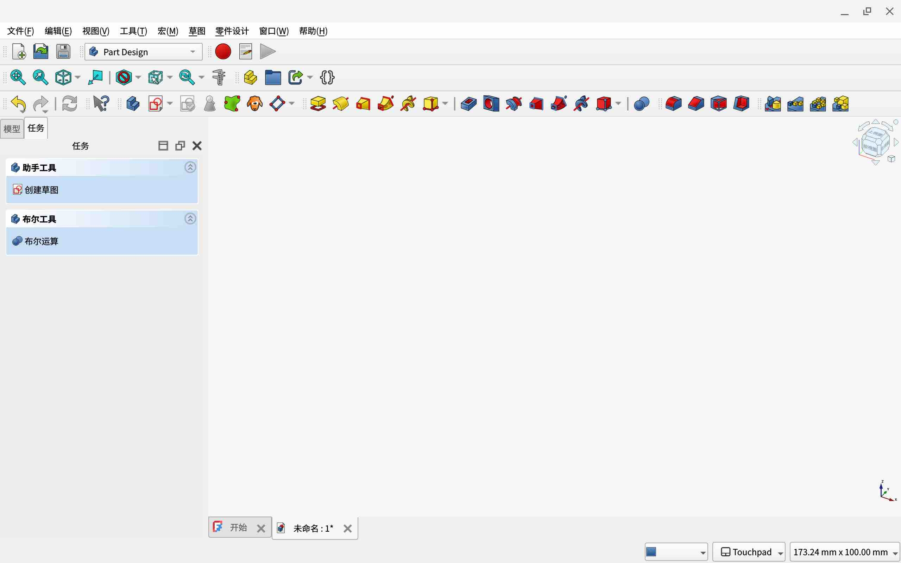
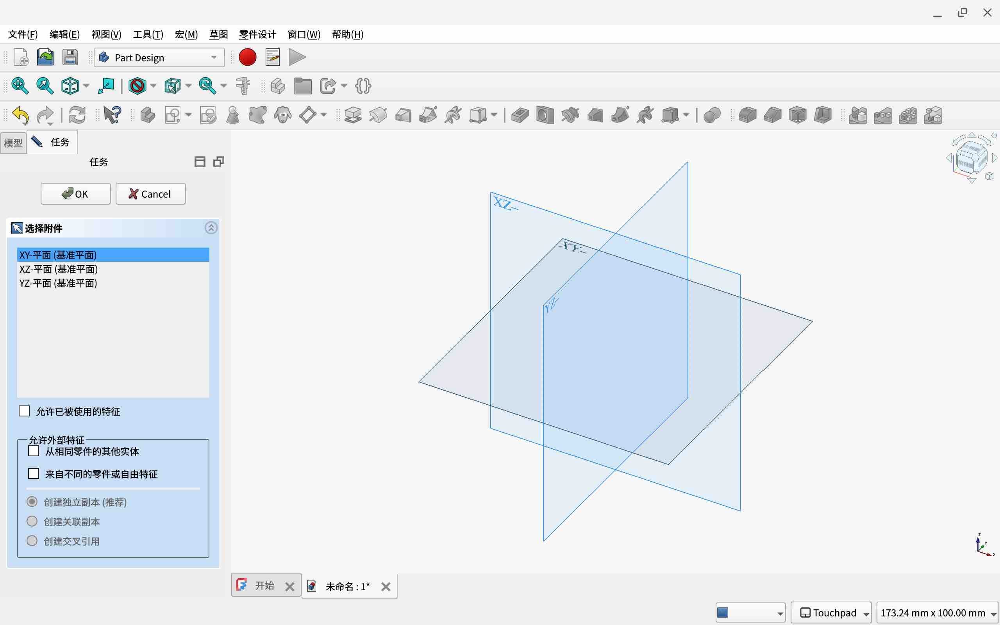
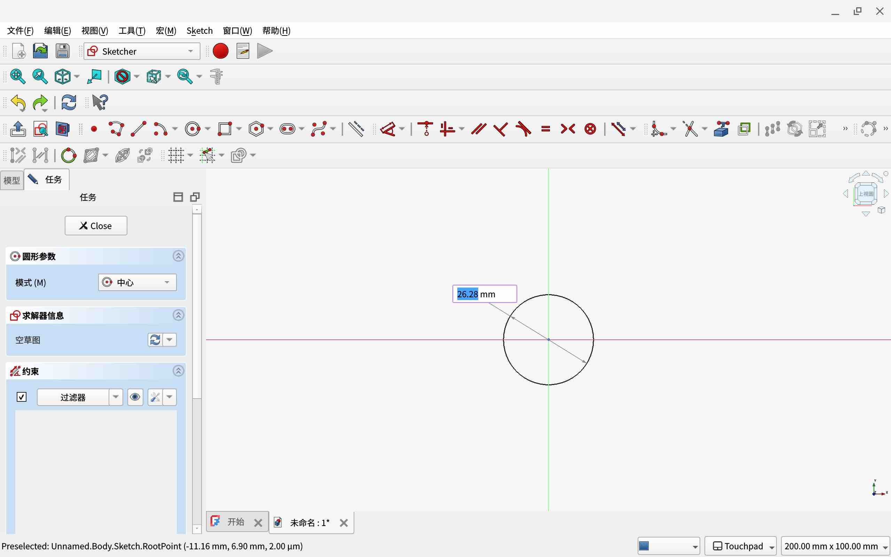

# [FreeCAD](../README.md)

## 目录

- [FreeCAD](#freecad)
  - [目录](#目录)
  - [下载&安装](#下载安装)
  - [第一个项目](#第一个项目)

## 下载&安装

- 从[FreeCAD官网](https://freecad.org)下载

- 对于Windows，使用下载下来的安装程序安装，随后启动。

- 对于MacOS，打开下载下来的文件，将FreeCAD拖入*应用程序*文件夹，随后从程序坞启动。

- 对于Linux，赋予下载下来的文件运行权限`chmod 744 FreeCAD.AppImage`，随后直接运行`./FreeCAD.AppImage`（将FreeCAD.AppImage替换为下载下来的文件）。

## 第一个项目

启动后，设置语言和主题。

打开`参数视图`。

打开`任务`（左侧），选择`创建草图`。

选择基准面（比如XY基准面）并确认。

开始绘制草图。

绘制时，可以通过输入数值来控制图形。输入的数值将会变成自动约束，约束图形。

绘制完成后，点击`close`。

点击`任务`中的`凸台`构建凸台（需要草图中的线首尾相连且构成封闭图形）。

完成后，点击顶面边线。

点击左侧的`倒角`。

点击`类型`选项。

切换到`两倍距离`选项（其实是两侧距离，翻译疏漏）。

由于倒角不能超过/等于该侧长度，如果想要倒角至一侧底部（比如高），请减去0.001单位。

由于功能繁多，此处不一一列举。

其他功能请访问[FreeCAD WIKI](https://wiki.freecad.org/User_hub/zh-cn)。

