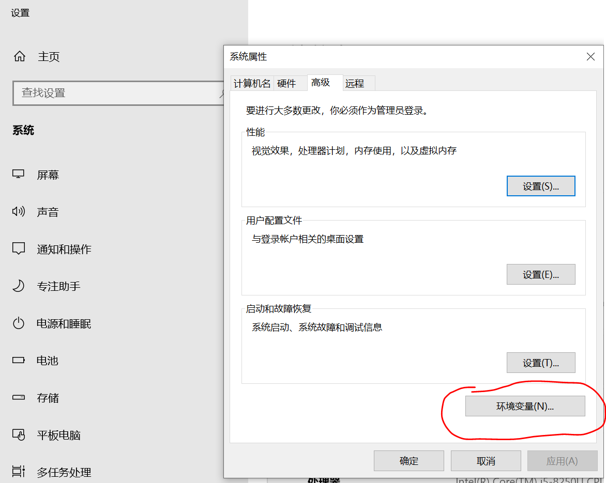
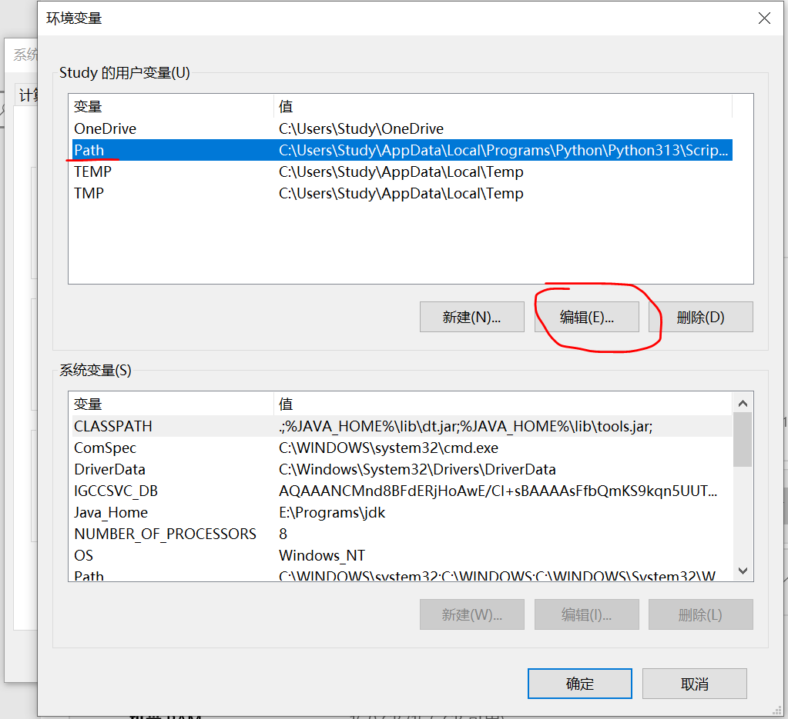
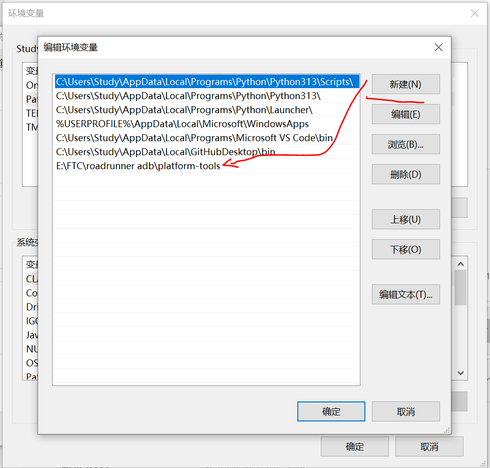
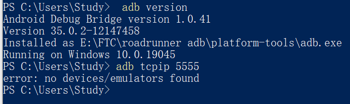

## 1. ADB（Android Debug Bridge）概述

### a) 简介
ADB 是 Android SDK 中的命令行工具，用于与 Android 设备通信并执行调试功能，包含以下组件：
- **客户端**：通过命令行调用的程序  
- **服务器**：管理客户端与设备间的通信  
- **守护进程 (adbd)**：运行在设备上执行命令  

### b) 安装 & 启动
1. 下载 Android SDK Platform Tools：（对于Android Studio用户，可以跳过此步骤，因为AS首次安装会自动下载。可以前往设置寻找sdk位置，从而找到platform-tools所在目录）
   - 对于Windows,前往 [https://dl.google.com/android/repository/platform-tools-latest-windows.zip](https://dl.google.com/android/repository/platform-tools-latest-windows.zip) 下载。
   - 对于MacOS[下载](https://dl.google.com/android/repository/platform-tools-latest-darwin.zip)。
   - 对于Linux[下载](https://dl.google.com/android/repository/platform-tools-latest-linux.zip)。如果你是尊贵的linux用户，那么你一定不再需要以下介绍了，对吧！
2. 配置环境变量：(可跳过，如跳过需每次先加载ADB所在目录e.g. cd "E:\FTC\adb\platform-tools",并在以下每一行指令前加上".\")
   - 将解压后的 `platform-tools` 目录添加到系统 `PATH` 中。
   - 对于MacOS与Linux，
      1. 编辑 Shell 配置文件（根据你的 Shell 选择）：
         - **Bash**：`nano ~/.bashrc`
         - **Zsh**：`nano ~/.zshrc`
      2. 在文件末尾添加：
         ```bash
         export PATH=$PATH:~/Android/Sdk/platform-tools
         ```
         > 替换 `~/Android/Sdk` 为你的 SDK 实际路径（如 `/home/user/Android/Sdk`）。
      3. 使配置生效：
         ```bash
         source ~/.bashrc  # 或 source ~/.zshrc
         ```
      4. 验证：
         ```bash
         adb version
         ```
   - 对于Windows，
      1. 打开 **系统设置**：
         - 搜索并打开 **查看高级系统设置(WIN10)** > 点击 **环境变量**。
         
      2. 修改用户变量：
         - 在 **用户变量** 列表中找到 `Path`，双击编辑。
         
         - 点击 **新建**，粘贴你的 `platform-tools` 完整路径（例如）：
           ```
           C:\Users\<用户名>\AppData\Local\Android\Sdk\platform-tools
           ```
           > 路径可能因安装位置而异（如 `C:\Android\Sdk\platform-tools`）。
         
      3. 确认保存：
         - 点击 **确定** 关闭所有窗口。
      4. 验证：
         - 打开新的 **命令提示符** 或 **PowerShell**，运行：
           ```cmd
           adb version
           ```
           
3. 设备端配置：`如果你使用的是奇妙的Control Hub，则跳过此步(该步骤理论上同一设备仅需一次)`
   - 在 Android 设备上启用开发者模式，并打开 USB 调试。
4. 启动命令行工具(e.g. Win+R powershell)

### c) 用法（加*号表示常用命令）

#### i. 设备管理
```bash
# *列出连接的设备
adb devices  

# *连接无线设备
adb connect <IP:端口>

# 断开设备
adb disconnect

# *断开所有设备
adb kill-server
```

#### ii. 应用管理
```bash
# 安装 APK
adb install [选项] <本地路径.apk>
# 示例：-r 覆盖安装，-s 安装到 SD 卡

# 卸载应用
adb uninstall <包名>

# 启动应用
adb shell am start -n <包名/活动名>
```

#### iii. 文件操作
```bash
# 推送文件到设备
adb push <本地路径> <设备路径>

# 从设备拉取文件
adb pull <设备路径> <本地路径>
```

#### iv. 调试 & 日志
```bash
# 查看设备日志（支持过滤）
adb logcat [-s TAG] [-c 清空日志]

# 进入设备 Shell
adb shell
```

#### v. 系统操作
```bash
# 重启设备（可选 recovery/bootloader 模式）
adb reboot [选项]

# 截图
adb shell screencap <设备文件路径>

# 录屏
adb shell screenrecord <设备文件路径>

# 备份与恢复
adb backup -apk -shared -all -f backup.ab
adb restore backup.ab
```

#### vi. 权限管理
```bash
# 获取 root 权限
adb root

# 挂载系统分区为可写
adb remount
```

#### vii. Shell 子命令
```bash
# 包管理
pm list packages
pm path <包名>

# 强制停止应用
am force-stop <包名>
```

#### viii. 其他
```bash
# *启用无线 ADB
adb tcpip <端口>

# 查看帮助
adb -help
```

### d) 练习
> **问题**：如何启用ControlHub无线 ADB 连接？  
> **答案**：
> 1. 打开 Control Hub ，有线链接至其C口 注意，即使使用无限传输，也需要有线连接开启端口！！此后同一设备不用再次设置，不同设备链接或被其他设备链接后需重新设置。
> 2. 打开powershell或其他命令行工具，打开安装了ADB的目录 
> 3. `adb tcpip 5555`  （此步之后可拔掉C口的链接线）
> 4. `adb connect <Android设备IP>:5555`  
> 5. `adb devices` 确认连接成功。
> 6. 如过程中断开链接，可尝试：1. `adb kill-server`后重试2; 2. 断开ControlHub电源，重新开机; 3.放弃ADB，选择有线链接。
