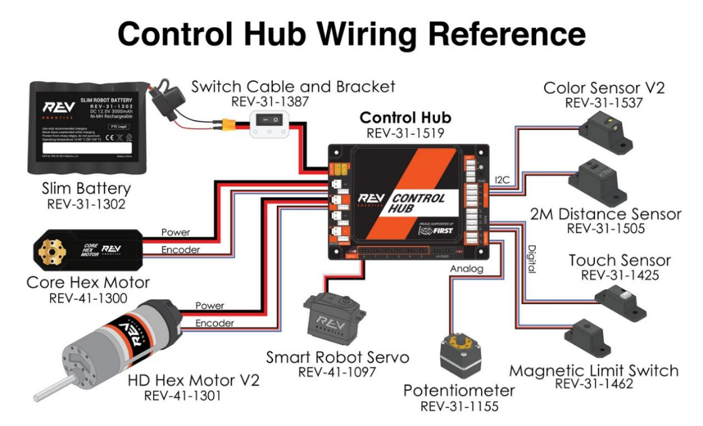
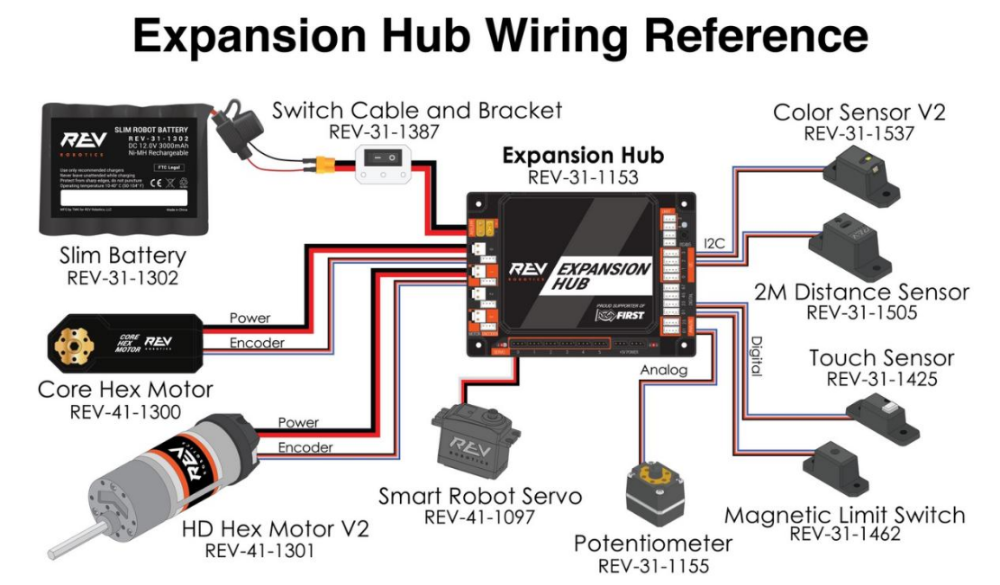
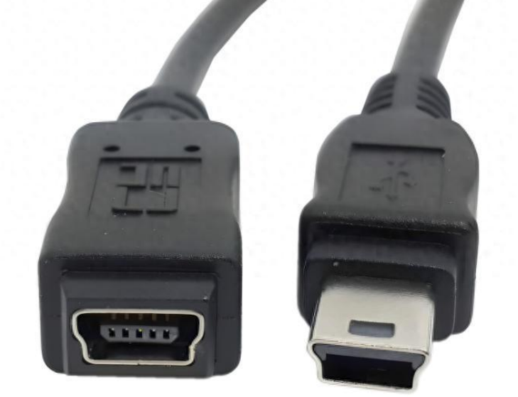

# [概览](README.md)

## 目录

- [概览](#概览)
  - [目录](#目录)
  - [关于硬件](#关于硬件)
    - [Control Hub \& Expansion Hub接口概述](#control-hub--expansion-hub接口概述)
    - [UART](#uart)
    - [RS485](#rs485)
    - [I2C](#i2c)
    - [SPI](#spi)
    - [舵机](#舵机)
    - [电机](#电机)
    - [电源口](#电源口)
    - [MINI USB](#mini-usb)
    - [USB OTG \& USB HOST](#usb-otg--usb-host)
  - [关于软件](#关于软件)
  - [下一章：环境配置](#下一章环境配置)

## 关于硬件

### Control Hub & Expansion Hub接口概述

||
|:---:|
| Control Hub及其外设 |

||
|:---:|
| Expansion Hub及其外设 |

### UART

名为Universal Asynchronous Receiver/Transmitter,有：

1. 异步通信：无时钟信号约定波特率
2. 点对点：仅支持双设备直连
3. 全双工：发送TX接收RX独立，可同时进行 的特点。

常见于：

- 网络传输芯片与处理器间通讯
- 部分传感器读取
- 电脑与开发板间调试通信

### RS485

UART的物理层增强版，可用于连接Control Hub与Expansion Hub

### I2C

名为Inter-Integrated Circuit,有：

1. 半双工
2. 同步通信：主从设备通过时钟线同步通信时间
3. 多主多从：支持多主设备竞争总线
4. 两线制：SDA（数据）&SCL（时钟）
5. 速度较低：100kbps 1400/3.4Mbps

的特点，常见于:

- 板载低速通信;
- EEPROM；
- 温度传感器；
- RTC时钟；
- IMU

### SPI

名为Serial Peripheral Interface，有：

1. 同步
2. 全双工
3. 四线制：SCK时钟，MOSI主发从收，MISO从发主收，SS/CS 片选，每从设备独立一根线
4. 高速：达k*10Mbps

的特点，常见于：

- 高速外设
- SD card
- 显示屏等

### 舵机

- 脉宽调制(PWM)信号线（白色或黄色）
- 电源（红色或橙色）
- GND（黑色或褐色）

### 电机

- 电源
- 编码器(encoder)连接线

### 电源口

Control Hub和Expansion Hub上分别各自有一个电源公口和母口，接口是XT30。一般推荐使用的电池是REV薄片电池。

|  |
|:---:|
|REV薄片电池|

### MINI USB

|  |
|:---:|
| mini USB母口（左）与mini USB公口（右）|

mini USB口无论在Control Hub还是Expansion Hub上都是连接Expansion Hub部分的接口,在REV Hardware Client中总是会显示为Expansion Hub.

你可以使用该接口将Expansion Hub接入Control Hub.

### USB OTG & USB HOST

USB HOST是指该设备在该USB接口是主设备,能接入输入输出设备等;USB OTG(On-The-Go)即该接口处该设备能够识别外部设备以决定该设备为主设备或从设备,比如将Android设备接入电脑查看Android的内置文件.

## 关于软件

对于FTC比赛，官方提供了完善的开发工具，我们需要遵循其``OpMode``（手动控制程序）格式，使用其提供的库来完成对机器人的控制；
有两种开发环境：``OBJ（onbotJava）``和``Android Studio``。

```人话
 如果有人胆敢使用blocks进行编程，会被程序部除名！！！！！！ -------27届程序部长
```

## [下一章：环境配置](环境配置.md)
