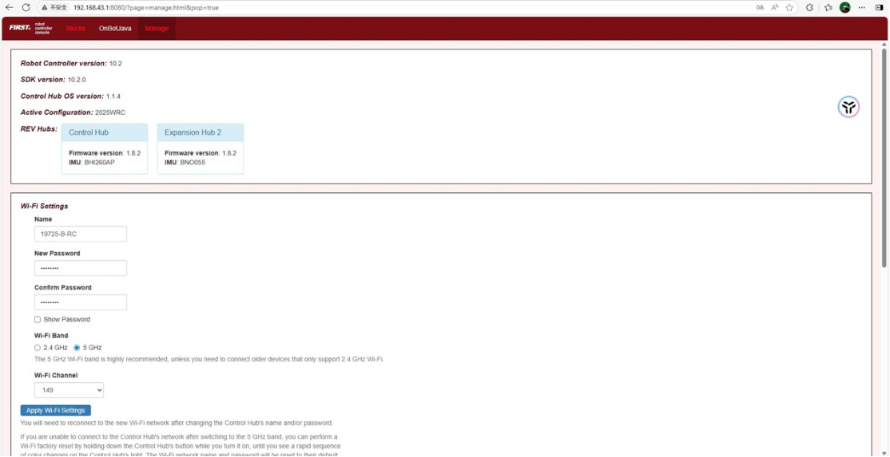
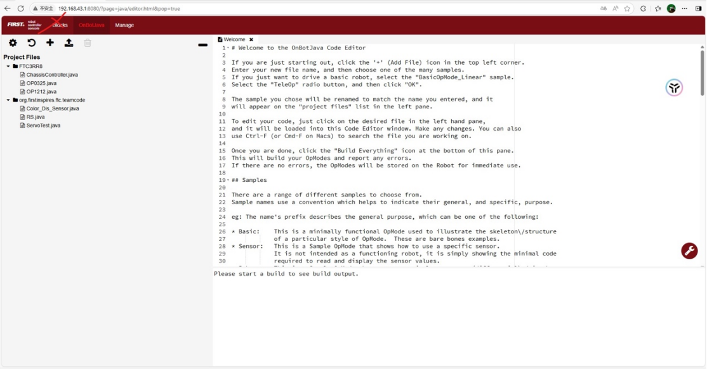
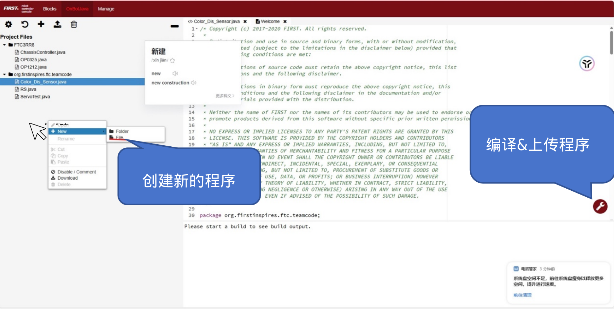
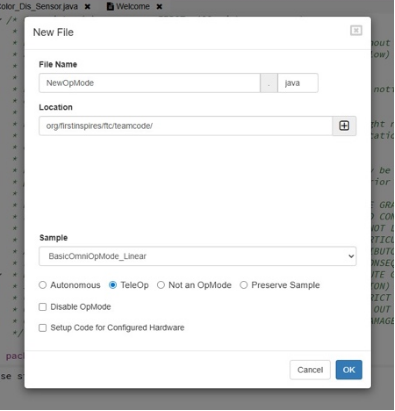
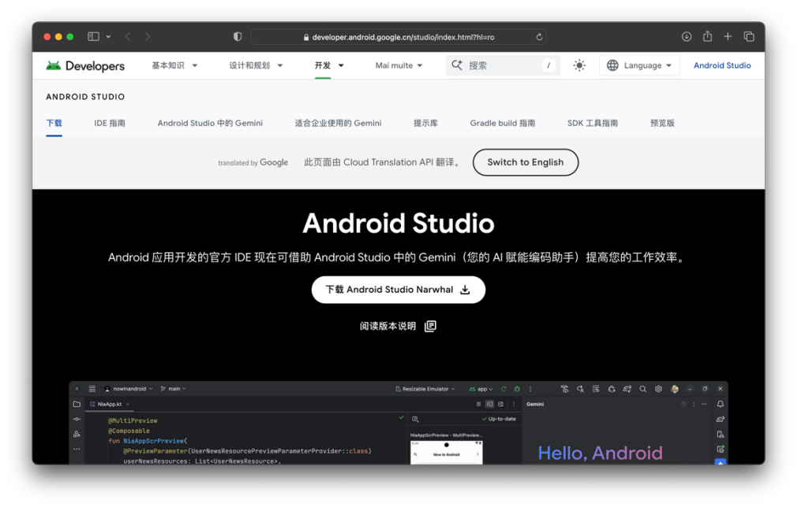
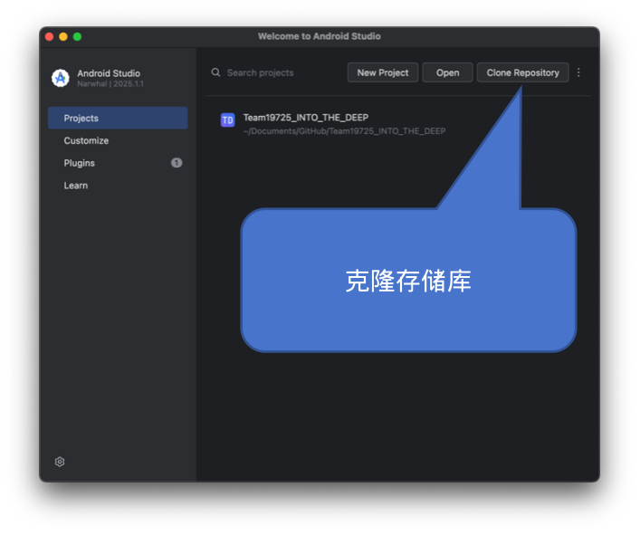
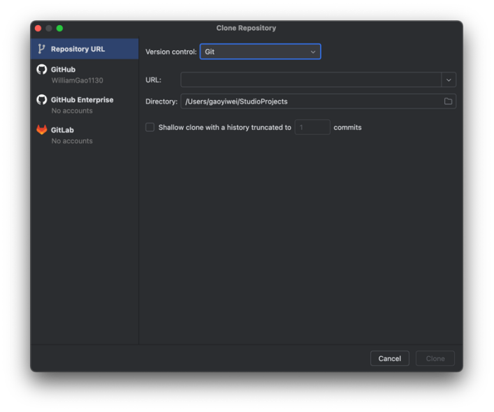

# [开发环境配置](README.md)

## 目录

- [开发环境配置](#开发环境配置)
  - [目录](#目录)
  - [OnBotJava](#onbotjava)
  - [Android Studio](#android-studio)
    - [下载](#下载)
    - [连接设备](#连接设备)

## OnBotJava

1. 连接上Control Hub网络
   - 账号、密码可以在Hub表面发现
   - 请给Hub通入足量电压并等候至绿灯亮起
2. 访问192.168.43.1:8080
   - 网页会显示其网络名称以及密码

3. 选择OnBotJava

这样，就启动了OnBotJava编程环境。

|  |
|:---:|
| Manage页面 |

|  |
|:---:|
| OnBotJava创建页面 |

|  |
|:---:|
| 创建程序&编译上传 |

|  |
|:---:|
| 创建Class时的设置 |

## Android Studio

### 下载

||
|:---:|
| Android Studio下载链接 |

从[https://developer.android.google.cn/studio/](https://developer.android.google.cn/studio/) 下载Android Studio。

||
|:---:|
| Android Studio克隆存储库 |

||
|:---:|
| 设置存储库URL |

从GitHub克隆存储库。存储库链接可在GitHub上找到：

[https://github.com/BluePowerRobotics/](https://github.com/BluePowerRobotics/)

这是我社GitHub页面。

如果遇到“Git未安装”的问题，请前往其官方网站下载安装包或使用Android Studio内置下载。

如果遇到“无法连接服务器”的问题，由于GitHub服务器位于国外，请使用更好的连接环境；亦或是使用镜像站替换。这里提供一个镜像站：bgithub.xyz，使用时将github.com替换即可。

需要注意的是，该镜像站也会镜像github返回的网页；在浏览器中访问github也可用其代替。有时候使用该镜像站时可以登录；但是依旧不能使用除了访问GitHub网站、下载/克隆存储库、文件以外的Github功能。

克隆好程序后，会进入加载支持库的阶段。名为“Gradle”的管理器会自动下载所需支持库。Android Studio会自动下载项目配置的Gradle版本。无论网络环境如何，这都需要一定时间。（国内连接更慢、更不稳定，可以通过镜像站——比如一些大学、公司会配置很多这种公开存储的镜像站，但这样需要更改gradle配置，不建议新手盲目尝试）这仅仅会在第一次加载存储库且不更改其依赖的情况下执行。

### 连接设备

连接Control Hub设备可以使用adb工具（但直接有线连接TypeC口可能是更简单稳定的选择）。

ADB, Android Debug Bridge, 是一个由*Google*开发的，用于调试Android的工具。

ADB工具在AS(Android Studio, 下同)中可以下载。

同时，可以从*google*直接下载platform-tools, 包含adb。

关于ADB的详细用法，我们将在之后的章节详细阐述。

这里，我们只要知道，通过ADB，我们可以将电脑上的代码传输至Control Hub。

使用Control Hub上的USB Type-C连接电脑。

等待直至AS上显示设备“REV Control Hub”字样。

这代表着设备已连接。

随后，你对代码的修改就可以通过右侧“RUN”按钮（向右三角或刷新符号）上传至Control Hub.